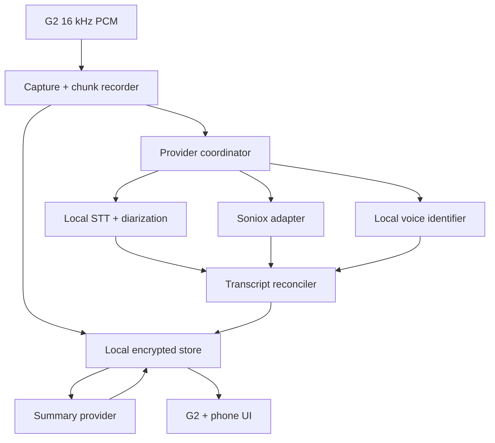

# Even G2 Voice Memory — MVP Design

**Status:** Proposed  
**Date:** 2026-09-13  
**Target:** Even Realities G2 on a current flagship Android phone (Snapdragon 8
Elite Gen 5, Dimensity 9500, or Tensor G5 class) or iPhone (A18 Pro/A19 class,
iOS 26+), using the public Even Hub SDK and WebGPU

## 1. Product definition

The MVP is an Even Hub app that records conversations through the G2 microphone
array, produces a speaker-separated transcript and AI summary, remembers
enrolled voices across conversations, and lets the user correct or name speakers
from the phone UI.

The core user promise is:

> Record a conversation now. Review it later with speakers separated. Name
> “Speaker 2” once, and future conversations can identify that voice as the same
> person.

The MVP must distinguish three related but separate operations:

1. **Speech-to-text** — convert audio into timestamped words.
2. **Diarization** — determine which anonymous speaker spoke each part:
   `speaker_a`, `speaker_b`, and so on.
3. **Persistent speaker identification** — match a session-local speaker to a
   saved person across recordings.

Soniox performs the first two operations. It does not, by itself, establish that
`speaker_1` today is the same human as `speaker_2` yesterday. Persistent
identity therefore remains a separate app-owned subsystem.

## High-level overview: how the app works

The MVP is one Even Hub web app for Android and iOS. The Even Realities phone app
hosts it in a WebView (Android WebView or WKWebView), the G2 supplies a mono 16 kHz microphone stream and displays a
small recording UI, and the same web app provides the richer companion interface
on the phone.

Every neural model runs on the phone as ONNX through ONNX Runtime Web, on WebGPU
or, for graphs too small to benefit from the GPU, WASM. Each model role has
its own Settings dropdown (see §6.1 _Model catalog and selection_); the defaults
below are chosen as the most accurate options expected to stay real-time on a
flagship phone:

| Job                    | Default model                                                                                                        | Purpose                                                                                          |
| ---------------------- | -------------------------------------------------------------------------------------------------------------------- | ------------------------------------------------------------------------------------------------ |
| Speech detection       | **Silero VAD v6**                                                                                                    | Finds speech regions so silence is not repeatedly transcribed or embedded.                       |
| Live speech-to-text    | **Moonshine Streaming Medium** (English); **Moonshine Streaming Small** language checkpoint for ja, zh, es, de, etc. | Incremental, low-latency captions while recording.                                               |
| Final speech-to-text   | **Qwen3-ASR-0.6B + Qwen3-ForcedAligner-0.6B**                                                                        | Re-transcribes stored speech after Stop into stable, word-timestamped, language-identified text. |
| Speaker representation | **CAM++ speaker-verification model**                                                                                 | Converts a clean speech window into a fixed-size voice embedding.                                |
| Summarization          | **Gemma 4 E2B (mobile QAT, 4-bit)**                                                                                  | Produces the structured, source-anchored summary after a recording is finalized.                 |

Exact exported model files and numeric precision are pinned only after they pass
WebGPU node-placement, accuracy, latency, battery, and thermal tests in the
Even-hosted WebView on both Android and iOS. Dropdowns choose among these validated local
options; they are not permission to silently swap in cloud inference.

At runtime, audio is saved immediately in short chunks and simultaneously passed
through the VAD. Speech windows go to the live STT model for transcription and
to the speaker-embedding model for voice embeddings. A lightweight non-neural
clustering algorithm groups similar embeddings within the current recording,
producing anonymous `Speaker 1`, `Speaker 2`, and so on. That combination is the
local diarizer; the MVP does not need a separate end-to-end diarization model.

Persistent recognition uses the same speaker-embedding space. When the user
labels `Speaker 2` as Alice, the app stores several high-quality embeddings from
that cluster in Alice's local voice profile. In later recordings, it compares a
new cluster's aggregate embedding against saved profiles. A name is accepted
only after enough speech, a strong absolute match, and a clear margin over the
next candidate; otherwise the speaker remains unknown. Corrections in the phone
UI relabel the session and, with permission, improve the saved profile.

When Soniox is selected, the PCM stream goes to Soniox for transcription and
session-local diarization instead of local STT plus local clustering. The
speaker-embedding model still runs locally on Soniox-attributed audio ranges, so
cross-session names and biometric voice profiles remain app-owned and on-device.

After a recording stops, the app runs the final STT pass, finalizes the
transcript, and summarizes it with the selected on-device LLM. Users may instead
choose an app-managed cloud summary endpoint, which receives only the
transcript—not audio or voice embeddings. Either way, the summary model returns
structured JSON containing a title, overview, key points, decisions, action
items, and open questions, each linked to supporting transcript segments. Long
conversations are summarized in chunks and then reduced into one final result.
Speaker references remain IDs, so renaming a person updates the rendered summary
without regenerating it.

All recordings, transcripts, anonymous clusters, confirmed person mappings,
voice profiles, and summaries are stored locally in a Turso (SQLite-compatible)
database persisted on the Origin Private File System, with IndexedDB as the
fallback if Turso fails the Phase 0 storage spike (see §8). The provider abstractions keep
capture and UI independent from the chosen STT, diarization, identity, and
summary implementations.

## 2. MVP scope

### Included

- Start, pause, resume, and stop a recording from the G2 UI.
- recordings are optionally not persisted (default not persisted). can be
  toggled in the glasses context menu.
- Choose the recording language in Settings (one language per recording, default
  English).
- Select the model for every local ML role from a Settings dropdown: VAD, live
  STT, final STT, speaker embedding, and summarization (options and defaults in
  §6.1).
- Capture the G2 four-microphone stream.
- Store recoverable, chunked session audio on the phone.
- Produce timestamped text with anonymous speaker turns.
- Save persistent voice profiles locally.
- Match session speakers against saved profiles conservatively.
- once matched update teh transcript in view wiith the actual names of the
  speakers.
- Show a session list, session summary, structured highlights, and transcript in
  the phone UI.
- Tap any speaker name in the summary or transcript to:
  - choose an existing person;
  - create a person;
  - change the full name;
  - set an optional short display name;
  - decide whether clean audio from this speaker may improve the saved voice
    profile.
- Apply a corrected identity to every turn belonging to that session-local
  speaker cluster.
- Support a local processing provider by default and a Soniox provider as an
  alternative.
- Provide a Soniox API-key field, validation action, replacement action, and
  delete action in Settings.
- Delete a recording, its audio, or a saved voice profile independently.

### Explicitly not in the MVP (but would like you to make a future features file)

From conversation:

- Live translation.
- Multi-language support (**first post-MVP priority**): automatic spoken-language
  detection, routing speech to the matching per-language models (for example
  switching Moonshine checkpoints mid-recording), and first-class mixed-language
  (code-switched) conversations. The MVP transcribes one user-selected language
  per recording. See §15 _Multi-language support_ for the candidate modes and
  research plan.
- Linking people to phone contacts.
- Automatic identification from names mentioned in conversation.
- person profiles (how you met, who they are, etc, that cue on to the screen
  once theyre recognized and not marked as do not show in settings)

For AI:

- fact checking
- cues like the native app

QoL:

- Automatic cloud sync or multi-device identity sharing.

## 3. Platform constraints and resulting architecture

Even Hub apps are web applications running inside a WebView in the Even
Realities phone app; the G2 acts as display and input hardware. The public SDK
exposes the four-microphone array as signed 16-bit little-endian, mono PCM at 16
kHz. It also exposes glasses UI, input events, and ordinary local storage, but
not arbitrary iOS/Android native speech frameworks, native ML runtimes, or
Keychain/Keystore access.
[Even Hub architecture](https://hub.evenrealities.com/docs/get-started/architecture),
[device APIs](https://hub.evenrealities.com/docs/build/device-apis)

Therefore the public-SDK MVP should be a **single Even Hub plugin with two
surfaces**:

- a minimal G2 heads-up UI;
- a full phone “companion” UI rendered by the same WebView application.

This is preferable to a separate native companion application. A separate
process would require a new, supported way to transfer the live G2 PCM stream
out of the Even WebView. A loopback server or ad-hoc cross-app relay is fragile
under Android background rules and should not become an MVP dependency.

“Local provider” consequently means **models executing on the phone inside the
plugin through ONNX Runtime Web**. WASM also implements lightweight DSP, codecs,
clustering, the Turso storage engine, and other non-neural work. The app cannot
call Android `SpeechRecognizer`, NNAPI, Core ML, or other native APIs unless
Even later exposes a bridge. Do not design around an undocumented bridge.

WebGPU is the MVP's compute API. WebNN would let the browser target an NPU, but
it is still flag-gated in Chrome and absent from Safari, so it cannot ship.
WebGPU is on by default in Chrome for Android (Android 12+, with GPU driver
coverage that varies by vendor, so each reference SoC must be checked) and in
Safari and WKWebView on iOS 26+. It still has to be verified inside
the Even-hosted WebViews, which may lag the system browser or disable features.
The release gate is stricter than feature detection: on each supported platform
the production Even WebView must expose `navigator.gpu` in a page and in a
dedicated worker without developer flags, and each chosen model must pass a
load-and-inference smoke test.

The WebGPU execution provider is not automatically faster. Every kernel is a GPU
dispatch, so small graphs (VAD, and possibly speaker embedding) can run much
faster on multithreaded WASM SIMD, and operators without WebGPU kernels (for
example dynamic int8 `MatMulInteger`) fall back to the CPU with a copy at each
boundary. Execution provider choice is therefore per model and benchmark-driven:
the same ONNX graph on WebGPU or WASM, not two neural implementations. If WebGPU
is unavailable on a platform, only models that meet their budget on WASM run
locally there.
[ONNX Runtime WebGPU](https://onnxruntime.ai/docs/tutorials/web/ep-webgpu.html)

**Supported hosts.** The product runs in the Even app on Android and iOS. The
same build must also run in standalone Chrome for Android and Safari on iOS
(with the phone microphone standing in for the G2) for development, testing, and
benchmarking. Standalone results never substitute for Even WebView results.
Pages must be served from a secure context (HTTPS or localhost) for WebGPU, OPFS,
and `SharedArrayBuffer`.

Even documents that the phone OS may reclaim a backgrounded WebView, dropping
in-memory state, WebSockets, and microphone capture. The app must checkpoint
state and audio eagerly and treat every relaunch as crash recovery.
[Even background and lifecycle](https://hub.evenrealities.com/docs/build/background-lifecycle)

## 4. High-level architecture



The provider coordinator owns one canonical audio clock and routes the same
frames to storage and the selected processors. Provider output is normalized
before it reaches the rest of the app, so UI and persistence code never depend
on Soniox response objects or a particular local model.

### Primary components

| Component               | Responsibility                                                                                            |
| ----------------------- | --------------------------------------------------------------------------------------------------------- |
| `G2AudioSource`         | Starts/stops `audioControl`, validates PCM format, sequences frames, and reports gaps.                    |
| `ChunkRecorder`         | Immediately writes recoverable audio chunks and a session journal.                                        |
| `ProviderCoordinator`   | Selects providers, fans out frames, handles backpressure/restarts, and normalizes events.                 |
| `ComputeRuntime`        | Creates WebGPU/WASM sessions, validates model node placement, runs local neural models, and reports failures. |
| `TranscriptionProvider` | Emits provisional and final timestamped words.                                                            |
| `DiarizationProvider`   | Emits session-local speaker turns/clusters.                                                               |
| `VoiceIdentityProvider` | Creates local embeddings, enrolls profiles, and proposes person matches.                                  |
| `TranscriptReconciler`  | Joins word timing, speaker turns, and person matches into stable transcript segments.                     |
| `SummaryProvider`       | Produces a structured, source-anchored summary from finalized transcript data.                            |
| `Repository`            | Persists recordings, chunks, people, profiles, mappings, transcripts, summaries, and settings (Turso/OPFS; IndexedDB fallback). |
| `SecretStore`           | Stores or retrieves provider credentials without exposing them to ordinary settings state.                |
| `GlassesController`     | Owns the constrained G2 recording/status UI.                                                              |
| `CompanionUI`           | Owns history, summaries, transcripts, labeling, people, retention, and provider settings.                 |

## 5. Canonical audio and provider contracts

Every timestamp should be derived from the number of captured samples, not
`Date.now()`. Wall-clock time is useful metadata, but it drifts and is
unsuitable for joining independent provider results.

```ts
type SessionId = string;
type PersonId = string;
type ClusterId = string;

interface AudioFrame {
  sessionId: SessionId;
  sequence: number;
  startSample: bigint;
  sampleRateHz: 16_000;
  channels: 1;
  encoding: "pcm_s16le";
  pcm: Uint8Array;
}

interface TimeRange {
  startSample: bigint;
  endSample: bigint;
}

interface TranscriptToken extends TimeRange {
  id: string;
  text: string;
  confidence?: number;
  language?: string;
  final: boolean;
  providerSpeakerId?: string;
  /** Streaming models without alignment interpolate word times within a segment. */
  timing: "word" | "segment-interpolated";
}

interface SpeakerTurn extends TimeRange {
  id: string;
  clusterId: ClusterId;
  confidence?: number;
  final: boolean;
}

interface VoiceMatch {
  clusterId: ClusterId;
  personId: PersonId;
  confidence: number;
  runnerUpMargin: number;
  evidenceMs: number;
  status: "candidate" | "accepted" | "rejected";
}
```

Provider interfaces remain separate even when one implementation can satisfy
more than one capability:

```ts
interface StreamingRun<Input, Event> {
  push(frame: Input): Promise<void>;
  events(): AsyncIterable<Event>;
  finish(): Promise<void>;
  abort(reason: string): Promise<void>;
}

interface TranscriptionProvider {
  readonly id: string;
  start(
    config: TranscriptionConfig,
  ): Promise<StreamingRun<AudioFrame, TranscriptToken>>;
}

interface DiarizationProvider {
  readonly id: string;
  start(
    config: DiarizationConfig,
  ): Promise<StreamingRun<AudioFrame, SpeakerTurn>>;
}

interface VoiceIdentityProvider {
  readonly id: string;
  embed(samples: AudioSlice[]): Promise<VoiceEmbedding[]>;
  identify(
    embeddings: VoiceEmbedding[],
    candidates: VoiceProfile[],
  ): Promise<VoiceMatch[]>;
  enroll(personId: PersonId, samples: AudioSlice[]): Promise<VoiceProfile>;
}

interface SummaryProvider {
  readonly id: string;
  summarize(input: SummaryInput): Promise<ConversationSummary>;
}
```

The coordinator also supports a fused capability. `SonioxSpeechProvider` can
emit both tokens and speaker assignments from one network stream, so the
coordinator must not send the same audio to a redundant standalone diarizer
merely to preserve conceptual interface purity.

```ts
interface ProviderCapabilities {
  transcription: "none" | "streaming" | "batch";
  diarization: "none" | "streaming" | "batch" | "fused-with-stt";
  persistentIdentity: boolean;
  languages: readonly string[] | "auto";
  execution: "local" | "cloud";
}
```

Local model providers depend on a separate compute abstraction:

```ts
type ExecutionTarget = "webgpu" | "wasm";

interface ComputeRuntime {
  readonly target: ExecutionTarget;
  load(model: ModelManifest): Promise<ModelSession>;
  benchmark(probe: BenchmarkProbe): Promise<BenchmarkResult>;
  dispose(): Promise<void>;
}

interface ComputeRuntimeSelector {
  candidates(): Promise<ComputeRuntime[]>;
  select(
    model: ModelManifest,
    policy: "low-power" | "balanced" | "fast",
  ): Promise<ComputeRuntime>;
}
```

The execution target is selected per model, not globally. WASM may win for the
VAD while WebGPU is required for STT and summarization. A runtime is eligible
only after model load, one known-answer inference, numerical-tolerance
validation, and a short latency/memory benchmark succeed. A WebGPU session that
places too many nodes on the CPU fallback is judged on its measured end-to-end
latency, not on the fact that it "uses the GPU".

## 6. Provider implementations

### 6.1 Default local provider

The default path keeps raw audio, transcripts, and voiceprints on the phone.

Recommended pipeline:

1. The selected VAD (default Silero VAD v6) divides PCM into speech and silence
   while preserving original sample offsets.
2. The selected live STT model (default Moonshine Streaming) transcribes speech
   incrementally in a Web Worker through WebGPU and emits provisional tokens.
3. The selected speaker-embedding model (default CAM++) creates an embedding for
   each clean, non-overlapping speech window through its independently selected
   execution target.
4. Online clustering groups embeddings into anonymous speakers during the
   recording.
5. After Stop, the selected final STT model (default Qwen3-ASR-0.6B with
   Qwen3-ForcedAligner-0.6B) re-transcribes stored speech into final,
   word-timestamped tokens, and a short post-session pass revisits cluster
   boundaries and merges/splits obvious errors.
6. Cluster-level embeddings are compared with enrolled local voice profiles.
7. The selected summary model (default Gemma 4 E2B) summarizes the final
   transcript.

### Model catalog and selection

Every neural role is configurable from a Settings dropdown. The dropdowns list
only entries from a bundled, versioned **model catalog**; each entry is a pinned
manifest (fields listed below), not a free-form URL. Defaults target a current
flagship Android phone or iPhone and favor the most accurate model expected to hold real
time for live roles, and the most accurate model that finishes in a reasonable
time for post-Stop roles.

| Role (dropdown)       | Default                                                                                                   | Other options                                                                                                                                                                                                                              | Runs        |
| --------------------- | --------------------------------------------------------------------------------------------------------- | ------------------------------------------------------------------------------------------------------------------------------------------------------------------------------------------------------------------------------------------ | ----------- |
| **VAD**               | Silero VAD v6 (~2 MB)                                                                                     | TEN VAD (lower-latency frame VAD; license review required)                                                                                                                                                                                 | Live        |
| **Live STT**          | Moonshine Streaming Medium, 245M (English); Moonshine Streaming Small, ~113–123M, per-language checkpoint | Moonshine Streaming Small (en); Moonshine Streaming Tiny, 34M (battery/thermal fallback); Whisper Small multilingual (mixed-language conversations, automatic language ID); Whisper Tiny multilingual; **Off** (capture and process later) | Live        |
| **Final STT**         | Qwen3-ASR-0.6B + Qwen3-ForcedAligner-0.6B (multilingual incl. en/ja, language ID, word timestamps)        | Whisper Large-v3-Turbo, timestamped export; Parakeet TDT 0.6B v3 (European languages only, no Japanese); Whisper Small; **Same as live** (skip re-transcription)                                                                           | After Stop  |
| **Speaker embedding** | CAM++ (≈7M, convolution-only, static-shape friendly)                                                      | WeSpeaker ResNet34-LM; ECAPA-TDNN (SpeechBrain); ReDimNet2-B6 (highest accuracy, heaviest)                                                                                                                                                 | Live + post |
| **Summary**           | Gemma 4 E2B, mobile QAT 4-bit (multilingual)                                                              | Gemma 4 E4B (better quality, slower, more memory); Qwen3.5-2B; **Cloud summary endpoint** (opt-in, transcript only); **Off**                                                                                                               | After Stop  |

Rationale for the defaults:

- **Live STT.** Moonshine Streaming uses a sliding-window encoder, so each new
  audio frame costs a bounded amount of compute instead of re-encoding Whisper's
  fixed 30-second window on every update. On English benchmarks the Small and
  Medium checkpoints are more accurate than Whisper Small at a fraction of the
  per-update cost. Its checkpoints are monolingual, so the live dropdown is
  filtered by the recording-language setting; Whisper Small remains the live
  choice for a best-effort `auto` language setting until multi-language support
  (see future features) lands. Moonshine has no word alignment, so live tokens
  use `timing: "segment-interpolated"`; final tokens replace them.
- **Final STT.** It does not need to be real-time, only to finish promptly after
  Stop (target: under 0.5× the recording duration on the reference device).
  Qwen3-ASR-0.6B gives much stronger Japanese and multilingual accuracy than
  live-class models, and the forced aligner supplies the word timestamps the
  reconciler needs.
- **Speaker embedding.** Embedding a 1.5–3 s window roughly once per second is
  cheap on any flagship, so the choice is driven by verification accuracy and
  WebGPU/WASM friendliness. CAM++ is accurate, small, and avoids attention and dynamic
  shapes. ReDimNet2-B6 is offered for users who prefer accuracy over battery.
- **Summary.** Gemma 4 E2B has a mobile-quantized ONNX export, handles Japanese,
  and fits alongside the other models in flagship memory. It runs only after
  capture ends, so it never competes with live roles.

Selection rules:

- Each option shows download size, languages, live/post role, download state,
  and—after the first-run benchmark—its measured real-time factor on this
  device. Options that fail load, known-answer, or budget checks are shown
  disabled with the reason.
- The first-run benchmark pre-selects the best passing option per role; the user
  may override it. The app never swaps the selected model at runtime; if a
  selected live model falls behind, the scheduler degrades per §6.1 and the
  session is finished by the final STT pass.
- Selections apply to the next recording. Each recording and provider run
  persists the model IDs, versions, and manifest hashes it used.
- Changing the final STT or summary model offers **Reprocess** on existing
  recordings; it never rewrites them automatically.
- **Changing the speaker-embedding model changes the embedding space.** Voice
  profiles are keyed by embedding-space version. On change, the app re-embeds
  every profile from its retained `voice_samples` audio clips; profiles without
  retained clips are marked **Needs re-enrollment** and do not auto-match until
  re-enrolled. The dropdown warns about this before applying.

```ts
type ModelRole =
  "vad" | "stt-live" | "stt-final" | "speaker-embedding" | "summary";

interface ModelCatalogEntry {
  id: string; // e.g. "moonshine-streaming-small-ja@<manifest-hash>"
  role: ModelRole;
  displayName: string;
  parameters: number;
  downloadBytes: number;
  languages: readonly string[] | "auto";
  timing?: "word" | "segment-interpolated"; // STT roles
  embeddingSpace?: string; // speaker-embedding role
  license: string;
  manifest: ModelManifest;
}

interface ModelSelection {
  vad: string;
  sttLive: string | "off";
  sttFinal: string | "same-as-live";
  speakerEmbedding: string;
  summary: string | "cloud" | "off";
}
```

### WebGPU compute strategy

Use ONNX Runtime Web with its native WebGPU execution provider (the
`onnxruntime-web/webgpu` build, which does not require JSPI and so also runs on
Safari) and its WASM execution provider as the model runtime. Do not make ONNX Runtime part of the domain contracts; the provider
contract remains based on audio frames and normalized events.

For every neural model:

1. Benchmark each model on WebGPU and on WASM, and pick the target recorded in
   its manifest for that platform, adjusted by the user's power policy.
2. Reject a model when CPU-fallback nodes or partition boundaries make it miss
   its sustained latency, memory, or battery budget. ONNX Runtime places
   operators without WebGPU kernels on its CPU provider; mixed execution is
   acceptable only when the whole graph passes the benchmark. Prefer exports
   that stay on the GPU (fp16 or 4-bit `MatMulNBits` rather than dynamic int8).
3. Keep GPU tensors resident between recurrent/streaming steps (ONNX Runtime
   `preferredOutputLocation: "gpu-buffer"` for KV caches and recurrent state),
   minimizing copies between JavaScript memory and the GPU. Evaluate WebGPU
   graph capture for fixed-shape streaming steps.
4. Respect per-device WebGPU limits (`maxBufferSize`,
   `maxStorageBufferBindingSize`, `shader-f16`) and iOS WebContent memory
   limits when choosing model size and precision.
5. Use WASM SIMD for PCM conversion, resampling, windowing, FFT/mel
   preprocessing when the model does not include it, Opus encoding, online
   clustering, and similarity bookkeeping.

Do not maintain a second hand-written neural implementation merely to claim
compatibility; the WebGPU/WASM choice is the same ONNX graph. If WebGPU
initialization or inference fails during a recording (including device loss),
capture continues and the session is marked for later processing or Soniox
transcription. Persistent local voice identification resumes only when the
compute runtime is healthy.

Prefer static input shapes and bounded audio windows. Dynamic shapes and
repeated graph recompilation are particularly harmful to streaming latency.
Benchmark the complete streaming loop, including feature extraction, tensor
upload, decoding, and output readback; model-kernel timing alone is not an
acceptance metric.

Each model has a manifest containing:

- URL or packaged asset path and integrity hash;
- byte size and minimum free-storage requirement;
- input/output names, shapes, dtypes, and sample-window parameters;
- execution target per platform (WebGPU or WASM) and required WebGPU features
  and limits;
- expected node placement and allowed CPU-fallback boundaries;
- numerical tolerance for the known-answer smoke test;
- quantization/precision and license;
- model and embedding-space version.

Model files should be downloaded once, hash-verified, and cached locally. The
recording path must not wait for first-time model download or shader
compilation: Settings exposes **Download local models**, which fetches the
current selection for every role, and Start falls back to
capture-now/process-later if a selected model is not ready. Unselected catalog
entries are downloaded only on demand.

The compute scheduler limits concurrency and owns thermal degradation:

- VAD and audio persistence have priority.
- Speaker embedding runs on completed clean windows.
- Live STT yields or reduces beam/search settings when inference falls behind
  real time.
- Post-session refinement and summarization never contend with active capture
  unless the benchmarked device has ample headroom.
- A WebGPU device loss or inference failure disposes model sessions, records a provider
  event, and switches to deferred processing or Soniox without stopping audio
  capture.

The model stack is the catalog above. Each model is referenced through a
manifest and content hash rather than hard-coded into the domain layer. Adding
or removing a catalog entry, or changing a default, is an explicit design
revision supported by evaluation results on the reference flagship device—not an
automatic runtime provider substitution.

For MVP planning, budget separate performance tiers:

| Tier          | Behavior                                                                                      |
| ------------- | --------------------------------------------------------------------------------------------- |
| Fast live     | Selected live STT model, provisional text, online clusters.                                   |
| Final local   | Selected final STT model reprocesses stored speech after Stop for stable text and boundaries. |
| Battery saver | Live STT set to Off; capture and process after Stop.                                          |

The application should select a safe tier after a short first-run benchmark and
let the user override it. Failure to load a local model must never destroy or
prevent saving the recording.

### 6.2 Soniox provider

`SonioxSpeechProvider` sends the G2 PCM stream directly to Soniox using:

```json
{
  "model": "stt-rt-v5",
  "audio_format": "pcm_s16le",
  "sample_rate": 16000,
  "num_channels": 1,
  "enable_speaker_diarization": true,
  "enable_language_identification": true
}
```

Soniox returns provisional and final tokens; when diarization is enabled, tokens
contain a session-local `speaker` value. The adapter converts those values to
canonical `ClusterId`s. Soniox warns that real-time diarization can revise
speaker attribution and is less accurate than asynchronous processing, so
provisional speaker labels must never mutate saved person profiles. Only final
output is eligible for identity matching or summary generation.
[Soniox real-time transcription](https://soniox.com/docs/stt/rt/real-time-transcription),
[speaker diarization](https://soniox.com/docs/stt/concepts/speaker-diarization)

Persistent identification remains local in Soniox mode:

- The app keeps a local copy of the audio.
- After Soniox finalizes a speaker turn, the app extracts the corresponding PCM
  ranges.
- The local `VoiceIdentityProvider` embeds sufficiently clean ranges.
- Evidence is aggregated per Soniox speaker label and matched to saved people.

This keeps biometric voice profiles off the Soniox path while benefiting from
its transcription and diarization.

#### Authentication

The Settings screen contains a masked Soniox API-key field with **Save**,
**Test**, **Replace**, and **Remove** actions. The key must never be bundled in
the `.ehpk`; Even explicitly warns that released packages are extractable.
[Even submission guidance](https://hub.evenrealities.com/docs/ship/app-submission)

Define storage behind:

```ts
interface SecretStore {
  put(name: "soniox_api_key", value: string): Promise<void>;
  get(name: "soniox_api_key"): Promise<string | null>;
  delete(name: "soniox_api_key"): Promise<void>;
}
```

For a personal/private MVP, implement this with an app-encrypted record in the
local store (§8) and a non-extractable Web Crypto key persisted in IndexedDB
(`CryptoKey` objects are structured-cloneable into IndexedDB but cannot be
stored in SQLite), use a strict Content Security Policy,
bundle all JavaScript locally, and never log credentials. This protects the key
from casual storage inspection but is not equivalent to OS Keychain/Keystore
isolation.

Before public release, replace direct use of the primary key with a small
authenticated credential service that stores the primary key encrypted and
issues short-lived Soniox WebSocket keys. Soniox recommends temporary keys for
browser/mobile clients so the long-lived key is not exposed in client code.
Audio can still stream directly from the phone to Soniox after the temporary key
is issued.
[Soniox direct streaming and temporary keys](https://soniox.com/docs/guides/direct-stream)

### 6.3 Summary provider

Summarization should be another replaceable provider, even though it was not
listed in the original three speech interfaces. The MVP output schema is more
important than the model vendor:

```ts
interface ConversationSummary {
  title: string;
  overview: string;
  keyPoints: AnchoredText[];
  decisions: AnchoredText[];
  actionItems: Array<{
    text: string;
    ownerPersonId?: PersonId;
    dueText?: string;
    sourceSegmentIds: string[];
  }>;
  openQuestions: AnchoredText[];
  generatedAt: string;
  providerId: string;
  sourceTranscriptRevision: number;
}
```

Every substantive item should carry transcript segment IDs. Tapping an item can
therefore open the supporting passage instead of presenting an untraceable model
claim.

The default implementation is `LocalSummaryProvider`, running the LLM selected
in the Summary dropdown (default Gemma 4 E2B) through WebGPU after a session is
finalized. It uses JSON-constrained decoding against the schema above; long
transcripts are summarized in chunks sized to the model's validated context and
memory budget, then reduced. `CloudSummaryProvider` satisfies the same contract
for users who pick **Cloud summary endpoint**; only the normalized transcript
and speaker display names are sent, not audio or voice embeddings. Cloud
summarization is opt-in and independent from Soniox transcription.

When a speaker is renamed, the summary normally does not need to be regenerated:
structured references use `personId`/`clusterId`, and the UI resolves the
current display name at render time. Regenerate only when the transcript text
changes.

## 7. Speaker identity model

### 7.1 Data concepts

- A **person** is user-managed identity metadata.
- A **voice profile** is biometric model data associated with a person and a
  model version.
- A **speaker cluster** is anonymous and local to one recording.
- An **attribution** maps one cluster to a person, with provenance and
  confidence.
- A **speaker label snapshot** records what the UI displayed at export time; it
  is not the source of truth.

Full and short names are intentionally separate:

```ts
interface Person {
  id: PersonId;
  fullName: string;
  shortName?: string;
  createdAt: string;
  updatedAt: string;
}

function displayName(person: Person, maxBytes?: number): string {
  return fits(person.fullName, maxBytes)
    ? person.fullName
    : (person.shortName ?? truncateUtf8(person.fullName, maxBytes));
}
```

The phone UI normally shows the full name. The G2 UI uses `shortName` when
provided because contextual-menu labels are limited to 32 UTF-8 bytes and
glasses text space is constrained.
[Even contextual menu](https://hub.evenrealities.com/docs/build/contextual-menu)

### 7.2 Enrollment and correction

The normal enrollment path is correction after a conversation:

1. User taps `Speaker 2` in a summary or transcript.
2. A bottom sheet shows likely existing people, all people, and **New person**.
3. User selects or creates a person and optionally enters a short name.
4. The app immediately saves the cluster-to-person attribution and re-renders
   every reference.
5. If **Learn this voice** is enabled, the app selects clean, non-overlapping
   segments from that cluster and updates the person's voice profile.
6. The operation is undoable. Undo removes any profile samples added by that
   operation as well as the attribution.

The app should retain several profile prototypes per person rather than
averaging all audio forever. Different environments, microphones, and vocal
conditions form different modes. Each prototype records model version, quality
metrics, creation time, and source recording.

### 7.3 Matching policy

Never assign a name from one short high-scoring window. Aggregate several
windows and require:

- minimum clean speech duration, initially 5–10 seconds total;
- an absolute score above a model-calibrated threshold;
- a sufficient margin over the second-best candidate;
- agreement across multiple windows;
- no overlap or severe-noise flag.

Conceptually:

```ts
const accepted =
  evidenceMs >= policy.minEvidenceMs &&
  best.score >= policy.minScore &&
  best.score - second.score >= policy.minMargin &&
  agreement >= policy.minWindowAgreement;
```

Below the acceptance threshold, display `Unknown` or `Possibly Alice`; do not
silently commit a person mapping. User corrections are authoritative. A
correction may add new positive samples, but the MVP should not implement
negative biometric learning or automatically merge two people.

## 8. Storage model

Use **Turso** (`@tursodatabase/database-wasm`, a SQLite-compatible engine
written in Rust and compiled to WASM) persisted on the **Origin Private File
System (OPFS)** behind a typed repository layer. IndexedDB is the fallback
implementation of the same repository interface; domain and provider code never
depend on which backend is active.

Why Turso on OPFS:

- The data is relational (recordings → turns → attributions → people →
  profiles), so SQL queries, joins, transactions, and versioned SQL migrations
  fit far better than hand-maintained IndexedDB indexes.
- OPFS synchronous access handles in a dedicated worker give file-like I/O with
  better performance than IndexedDB for many small writes.
- A SQLite-compatible file format keeps export, debugging, and future sync
  options open.

Constraints and mitigations:

- **Cross-origin isolation.** Turso's browser build runs file I/O in a Web
  Worker through a synchronous OPFS interface and shares buffers with the main
  thread through `SharedArrayBuffer`, which requires COOP/COEP cross-origin
  isolation. Phase 0 must confirm that Even-hosted plugin content can be
  cross-origin isolated and that OPFS `createSyncAccessHandle` works in the
  production Even WebView on each platform. If not, use the IndexedDB backend.
- **Beta software.** The Turso WASM package is beta. Phase 0 must verify that the
  database survives force-stop mid-write, background reclaim, and `.ehpk`
  upgrades without corruption. All storage access goes through one storage
  worker so the backend can be swapped.
- **Encryption.** Turso's at-rest encryption is experimental and not readily
  enabled in the WASM build, so the MVP does not rely on it. The app encrypts
  sensitive payloads (session audio, voice prototypes, voice samples, secrets)
  with Web Crypto before they reach storage. The non-extractable `CryptoKey`
  lives in IndexedDB because key objects cannot be stored in SQLite.
- **Audio blobs.** Audio chunks are stored as separate encrypted OPFS files,
  referenced and checksummed from the `audio_chunks` table, rather than as
  large BLOBs inside the database. This keeps the database and its write-ahead
  log small and makes deleting audio a cheap file removal. The Phase 0 spike
  confirms this against in-database BLOBs.
- **Quota.** Request persistent storage (`navigator.storage.persist()`) and
  surface quota pressure in the UI before capture can fail.
- **Vector search.** Turso's native vector search is not needed for the MVP:
  there are few people and prototypes, prototypes are encrypted, and brute-force
  cosine similarity in the worker is trivial at that scale.

Suggested entities:

| Entity                 | Important fields                                                                            |
| ---------------------- | ------------------------------------------------------------------------------------------- |
| `recordings`           | id, started/ended time, state, audio format, audio retention, provider IDs, recovery cursor |
| `audio_chunks`         | recording ID, sequence, start/end sample, codec, OPFS file path, byte length, checksum      |
| `transcript_tokens`    | recording ID, sample range, text, final, provider run, confidence                           |
| `speaker_turns`        | recording ID, cluster ID, sample range, final, confidence                                   |
| `speaker_attributions` | recording ID, cluster ID, person ID, confidence, source (`auto`/`manual`), revision         |
| `people`               | full name, short name, timestamps                                                           |
| `voice_profiles`       | person ID, embedding-space version, encrypted prototypes, quality, re-enrollment state      |
| `voice_samples`        | profile ID, source recording/range, optional encrypted audio clip, consent flag             |
| `summaries`            | recording ID, structured JSON, transcript revision, provider, status                        |
| `provider_runs`        | recording ID, provider, config version, start/end state, errors, resume metadata            |
| `settings`             | non-secret settings only, including per-role model selection                                |

Do not copy a person's name into every transcript row. Transcript turns refer to
a `clusterId`; a mapping table resolves that cluster to a person. This makes
renaming and correcting instant, consistent, and reversible.

### Audio storage and retention

Raw 16 kHz mono PCM is approximately 115 MB/hour. Store incoming PCM only in
short recovery chunks, then compress finalized chunks to Opus in a worker. At
24–32 kbit/s, conversational audio is roughly 11–14 MB/hour before container
overhead.

Default retention proposal:

- full compressed recording: retained until user deletes it;
- raw recovery chunks: deleted after compressed chunk verification;
- saved voice samples: retained with the voice profile;
- embeddings: retained until **Forget voice**;
- transcript and summary: retained until recording deletion.

Settings should also support **Delete audio after processing**, leaving
transcript, summary, attribution, and embeddings. Deleting a recording must not
delete a person's profile unless the user explicitly chooses to remove samples
sourced from that recording.

## 9. Recording and recovery flow

### Start

1. Create a `recordings` row in `starting` state.
2. Create the G2 page before requesting glasses audio, as required by the SDK.
3. Start `audioControl(true, AudioInputSource.Glasses)`.
4. Start the chunk recorder before any provider connection.
5. Start local workers or Soniox.
6. Mark the recording `recording` only after durable capture succeeds.

### During recording

- Persist ordered audio chunks every 5–10 seconds.
- Persist final tokens and turns immediately; provisional text remains
  replaceable.
- Update the recovery cursor after each verified chunk.
- Never block audio capture on STT, network, summary, or UI rendering.
- If a processor falls behind, degrade live display and process stored chunks
  later rather than dropping capture audio.

### Stop

1. Stop G2 capture.
2. Flush and verify the last audio chunk.
3. Finish provider sessions and store final tokens.
4. Run final local speaker clustering/identity matching.
5. Reconcile stable transcript segments.
6. Mark the recording `captured`.
7. Generate the summary.
8. Mark the recording `ready`; summary failure is represented separately and
   does not invalidate the recording.

### Recovery

On launch, inspect sessions in `starting`, `recording`, or `finalizing` states.
Verify checksums and reconstruct the last valid sample cursor. Show **Recovered
recording** and offer **Finish processing** or **Discard**. Never silently
resume microphone capture after a process restart.

For Soniox disconnects, close the provider run, create a new run, and continue
from the next durable sample. A small overlap may be resent for language
context; normalized sample ranges and token IDs must de-duplicate the overlap.

## 10. User experience

### G2 surface

The G2 interface stays intentionally small:

**Idle**

- `Start recording`
- selected provider: `Local` or `Soniox`

**Recording**

- visible recording indicator and elapsed time;
- current stable speaker display name or `Speaker 2`;
- last one or two lines of finalized transcript when live text is available;
- degraded-state text such as `Saving — processing later` when local compute or
  network falls behind.

**Actions**

- Pause/resume.
- Add marker.
- Stop and summarize.

Use `textContainerUpgrade` for live status to avoid redraw flicker, and keep
contextual-menu actions short. The app must retain a persistent, unambiguous
recording indicator; it must not behave like a covert recorder.

### Phone companion surface

The phone UI is the full application:

1. **History** — recordings with date, duration, title, processing state, and
   known people.
2. **Recording detail** — overview, key points, decisions, actions, questions,
   and a searchable transcript.
3. **Speaker sheet** — opened by tapping any speaker name in either summary or
   transcript.
4. **People** — full name, short name, voice-profile quality, source samples,
   rename, merge manually, and forget voice.
5. **Settings** — processing provider, Soniox key, recording languages, one
   model dropdown per local ML role (VAD, live STT, final STT, speaker
   embedding, summary) with benchmark results, local performance tier,
   summary/privacy controls, and retention.

Speaker names must be interactive anywhere they appear. Summary JSON therefore
carries speaker/person references rather than baking names into prose where
possible. For free-form overview text, render tagged spans produced by the
summary schema.

### Soniox settings behavior

- Key field is masked and never redisplays the stored key.
- **Test key** performs the smallest supported authenticated request and reports
  only success or a sanitized error.
- Switching from Soniox to Local takes effect on the next recording; it does not
  alter old recordings.
- Removing the key disables new Soniox sessions but leaves existing transcripts
  intact.
- Provider and data-transfer descriptions clearly state whether audio leaves the
  phone.

## 11. Privacy and safety requirements

Voiceprints are biometric data. The product should treat them as more sensitive
than an ordinary contact label.

- Local is the default provider.
- Show a persistent recording indicator on both surfaces.
- Explain that recording-consent laws vary and require the user to comply.
- Never upload voice embeddings or profile samples in Soniox mode.
- Encrypt stored voice profiles, samples, and session audio.
- Bundle application code; do not load third-party scripts at runtime.
- Apply a restrictive CSP and explicit network allowlist. Even Hub requires both
  a manifest network whitelist and normal browser CORS compliance.
  [Even networking](https://hub.evenrealities.com/docs/build/networking)
- Redact secrets and transcript contents from diagnostics by default.
- **Forget voice** deletes embeddings and stored profile samples, while allowing
  the user to choose whether historical transcripts retain the person's textual
  label.
- Export should distinguish user-confirmed from automatically inferred
  identities.

## 12. Proposed repository structure

```text
apps/
  even-hub/                 # WebView app, G2 controller, phone UI
packages/
  domain/                   # Canonical types and invariants
  capture/                  # Even SDK audio adapter and chunk recorder
  pipeline/                 # Provider coordinator and reconciler
  provider-local/           # VAD, local STT, clustering, embeddings
  provider-soniox/          # Soniox WebSocket adapter
  provider-summary/         # Structured summary client/provider
  storage/                  # Turso/OPFS repositories (IndexedDB fallback), migrations, crypto
  ui/                       # Shared phone UI components
services/
  summary-api/              # Optional transcript-only summarization
  credential-broker/        # Required before public Soniox release
```

Keep provider packages dependent on `domain`, not on UI or storage
implementations. Persist provider IDs, model versions, configuration hashes, and
output revisions so results can be reproduced or reprocessed after models
change.

## 13. Delivery plan

### Phase 0 — feasibility spikes

Time-box these before feature work:

1. Record uninterrupted G2 audio for 60 minutes on the reference flagship
   Android devices and iPhones; lock/background the phone and document actual
   behavior.
2. Verify that the production Even WebView on Android and on iOS exposes
   `navigator.gpu` without flags, in the page and in a dedicated worker, then
   inventory the adapter, `shader-f16`, buffer limits, a known-answer compute
   shader, Web Workers, WebAssembly SIMD and threads, `SharedArrayBuffer`,
   whether plugin content can be cross-origin isolated (COOP/COEP), OPFS sync
   access handles, storage quota, and relevant limits. Run the same inventory
   in standalone Chrome for Android and Safari on iOS, but do not infer Even
   WebView support from them.
3. Produce or verify ONNX exports for every catalog entry (Moonshine Streaming
   and Qwen3-ASR/ForcedAligner are the least proven under ONNX Runtime Web),
   then run known-answer and sustained benchmarks on WebGPU and WASM, on Android
   and iOS. Record real-time factor, peak memory, battery drain, thermals, node
   placement (CPU fallback), execution target, and numerical drift. Benchmark live roles concurrently
   (VAD + live STT + speaker embedding for 60 minutes), and post-Stop roles
   (final STT, then summary) on a 60-minute recording, to confirm the defaults
   in §6.1 or revise them.
4. Verify Turso WASM on OPFS in the production WebView: durability across
   force-stop mid-write, backgrounding, and `.ehpk` upgrades; write latency
   during capture; quota and eviction behavior; and audio chunks as OPFS files
   versus in-database BLOBs. Record the decision between Turso/OPFS and the
   IndexedDB fallback.
5. Verify Soniox WebSocket access through the Even network whitelist/CORS path
   with raw G2 PCM.
6. Verify whether the chosen encrypted secret mechanism persists correctly
   across app upgrades.

Failure of live local STT performance changes the default local tier to
capture-now/process-after-stop, or temporarily makes Soniox the recommended
transcription provider. Failure to run the speaker-embedding model acceptably
on-device (WebGPU or WASM) on a platform is a product blocker for that platform
because persistent identity is the differentiator. Missing WebGPU in an Even
WebView blocks local STT and summaries on that platform, not capture or Soniox.

### Phase 1 — durable capture

- G2 start/stop UX.
- Chunk recorder, checksums, recovery journal, session history, playback, and
  delete.
- No speech processing required for the first vertical slice.

### Phase 2 — normalized transcript and diarization

- Provider contracts and coordinator.
- Local VAD/STT/diarization implementation.
- Transcript UI with anonymous clusters.

### Phase 3 — people and persistent voices

- People, full/short names, speaker sheet, enrollment, identification,
  confidence policy, correction, and undo.
- Evaluation harness with same-speaker/different-speaker pairs and realistic G2
  audio.

### Phase 4 — Soniox

- Settings/secret storage.
- Soniox streaming adapter, reconnect, provisional/final handling, and local
  identity fusion.
- Network/privacy disclosure.

### Phase 5 — summaries and hardening

- Structured summary provider and anchored phone UI.
- Failure/retry states, exports, retention controls, deletion semantics, and
  beta QA.
- Android and iOS kill/relaunch tests and extended battery/storage tests.

## 14. MVP acceptance criteria

The MVP is complete when:

- A 60-minute G2 recording survives normal backgrounding and, if terminated,
  recovers all fully persisted chunks without corrupting the session.
- Local and Soniox modes produce the same canonical transcript/turn data shape.
- The production Even WebView exposes WebGPU without user flags on every
  supported Android and iOS device, and the app runs in standalone Chrome for
  Android and Safari on iOS.
- The local provider passes its known-answer tests and sustained benchmarks on
  its selected execution targets, including any permitted per-operator CPU
  fallback.
- Every default model in the §6.1 catalog holds its budget on the reference
  flagship device: live roles together sustain real time for 60 minutes without
  thermal throttling that drops live captions, and final STT plus summary finish
  within the post-Stop target.
- Each model-role dropdown lists only validated catalog entries, applies to the
  next recording, and records the chosen model IDs on the recording.
- Switching the speaker-embedding model re-embeds profiles from retained samples
  or marks them **Needs re-enrollment**; profiles from different embedding
  spaces are never compared.
- A WebGPU device loss, inference, or out-of-memory failure does not stop or corrupt
  audio capture.
- Tapping a speaker in either transcript or summary can assign a full name and
  optional short name.
- Relabeling one cluster updates all references without rewriting transcript
  text.
- A previously enrolled speaker is recognized in a later recording only after
  sufficient evidence; low-confidence matches remain unknown.
- A mistaken match can be corrected and undone without leaving contaminated
  profile samples.
- Soniox API credentials are never present in the packaged app, logs, exports,
  or ordinary settings records.
- Local mode sends no audio, transcript, or voiceprint data off-device except
  when the independently controlled cloud-summary option is enabled.
- The app continues saving audio if STT, diarization, identification, summary
  generation, or the network fails.
- Deleting audio, deleting a recording, and forgetting a voice have distinct and
  tested semantics.

## 15. Reserved future extensions

### WebNN — reserved, not implemented

WebNN can reach phone NPUs, which may matter for battery. Add it later as
another `ComputeRuntime` target once it ships without flags in the Even
WebViews and the selected models pass the same known-answer,
sustained-performance, battery, and lifecycle tests. It must not change
provider or domain contracts.

### Multi-language support — first post-MVP priority

The MVP transcribes one user-selected language per recording. Multi-language
support has to decide which of three modes can run well on-device through WebGPU,
possibly with different modes for the live and final passes:

| Mode             | Behavior                                                                                                    | Likely building blocks                                                                        |
| ---------------- | ----------------------------------------------------------------------------------------------------------- | --------------------------------------------------------------------------------------------- |
| **A. Select**    | User picks one language, or a small set of expected languages, per recording.                               | Existing per-language catalog entries; language hints.                                        |
| **B. Per line**  | Detect the language of each utterance or speaker turn and route it to that language's model.                | Standalone language-ID model on VAD utterances; warm per-language Moonshine checkpoints.      |
| **C. Mixed**     | First-class code-switching, including language changes mid-sentence, with a language tag on every token.   | A single multilingual model (live and/or final); Qwen3-ASR plus ForcedAligner for the final pass. |

Initial state-of-the-art notes (September 2026), to be confirmed by the research
task:

- Single multilingual models are generally favored over "detect, then route"
  cascades for code-switched speech. Cascades work when switches happen at clean
  sentence or turn boundaries. Mid-sentence switching remains much harder for
  every system.
- **Qwen3-ASR** (the current final-pass default) supports 52 languages and
  dialects, identifies the language before decoding, and claims to handle
  language switches within one recording. Qwen3-ForcedAligner supports
  code-switched alignment.
- **NVIDIA Nemotron 3.5 ASR Streaming 0.6B** is a cache-aware streaming model
  covering 40 locales with per-utterance automatic language detection. It is a
  candidate multilingual live model, but it has no documented ONNX export and
  does not document mid-sentence switching.
- **Moonshine Streaming** checkpoints are monolingual, so on their own they
  support only modes A and B.
- **Whisper** detects language per 30-second window and handles mid-window
  switching poorly.
- Standalone language-ID options include the SpeechBrain ECAPA-TDNN VoxLingua107
  model (107 languages) and heavier MMS-based models. Frame-level and
  token-level "language diarization" is an active research area.
- **Soniox** `stt-rt-v5` already tags every token with a language and handles
  mid-sentence switching, so the Soniox provider mostly needs mapping to
  canonical language tags.
- Useful test data includes CS-FLEURS, SwitchLingua, MLC-SLM, and FLEURS, plus
  real G2 recordings. Code-switching ability learned on one language pair
  transfers only modestly to unseen pairs, so priority pairs (for example
  English/Japanese) must be evaluated directly.

Work order: survey and evaluation set first, then spikes (per-line language ID,
single multilingual live model, live checkpoint routing, final-pass
code-switching accuracy), then a decision record choosing the shipped modes.
Implementation then makes `TranscriptToken.language` first-class (BCP-47 tags
plus confidence), replaces the single-language setting with the chosen modes,
adds routing or multilingual catalog entries, updates the transcript UI for
mixed scripts and G2 byte limits, lets the user choose the summary language, and
verifies that speaker identification is independent of the language spoken.
Live translation builds on this work.

### Live translation — reserved, not implemented

Reserve an optional `TranslationProvider` and language fields on tokens, but do
not expose translation UI in the MVP. Soniox already supports a translation
block on its real-time request, so the Soniox adapter can add the capability
later without changing capture or transcript storage. Translation must remain
distinct from source tokens so the original transcript is preserved.

### Phone-contact linking — reserved, not implemented

Reserve an optional external reference on `Person`:

```ts
interface ExternalPersonLink {
  provider: "phone_contacts";
  opaqueId: string;
}
```

Do not request contacts permission in the MVP. The public Even Hub SDK does not
currently expose contacts, so this feature will require a future Even bridge or
a supported native companion architecture. Store only an opaque contact
identifier, never duplicate the address book into the voice-profile database.

## 16. Final recommendation

Build the MVP as one Even Hub web application with a small glasses surface and a
rich phone surface. Use a fully normalized, sample-clock-based pipeline; keep
transcription, diarization, persistent identity, and summarization conceptually
separate; let Soniox fuse only the first two; and keep persistent voiceprints
local in every mode.

The biggest technical risk is not Soniox integration. It is whether WebGPU is
exposed in the Even-hosted WebViews on Android and iOS, and whether local STT
and speaker models sustain acceptable performance there under thermal, memory,
and lifecycle pressure. Resolve that before committing to a model or
promising live operation. The biggest product-risk control is conservative
identity: an unknown speaker is mildly inconvenient, while confidently showing
the wrong person's name damages trust and contaminates future enrollment.
